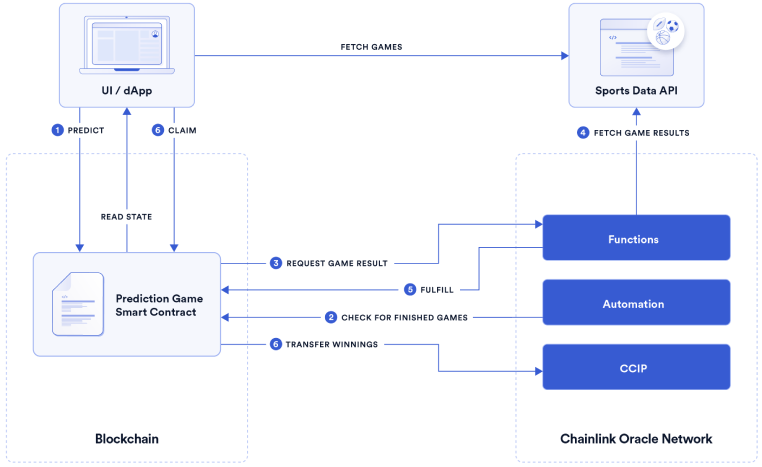

# Bet on Balls

Additionally, the project showcases how to send automatic payouts using [Chainlink Automation](https://chain.link/automation) and how to transfer tokens cross-chain using [Chainlink CCIP](https://chain.link/cross-chain).

## Requirements

- Node.js version [18](https://nodejs.org/en/download/) or higher

## Getting Started

Clone the repo:

It contains two separate projects:

- [`contracts`](./contracts/) - the smart contracts
- [`app`](./app/) - the frontend

Navigate to each directory and follow the instructions in their respective README files, starting with the contracts.

## Solution Overview

 

Code references:

1. Predict game result: [PredictionGame.sol#L116](./contracts/contracts/SportsPredictionGame.sol#L116)
2. Check for finished games: [PredictionGame.sol#379](./contracts/contracts/SportsPredictionGame.sol#L379)
3. Request game result: [ResultsConsumer.sol#L65](./contracts/contracts/ResultsConsumer.sol#L65)
4. Fetch game result: [sports-api.js#L63](./contracts/sports-api.js#L63)
5. Fulfill game result request [ResultsConsumer.sol#L105](./contracts/contracts/ResultsConsumer.sol#L105)
6. Claim winnings [SportsPredictionGame.sol#L151](./contracts/contracts/SportsPredictionGame.sol#L151) 
   6.1 Transfer winnings [NativeTokenSender.sol#L66](./contracts/contracts/ccip/NativeTokenSender.sol#L66)

## Resources

- [Chainlink Functions Docs](https://docs.chain.link/chainlink-functions)
- [Chainlink Automation Docs](https://docs.chain.link/chainlink-automation/introduction)
- [Chainlink CCIP Docs](https://docs.chain.link/ccip)
